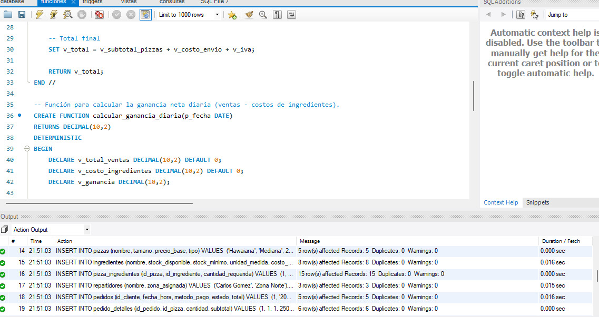
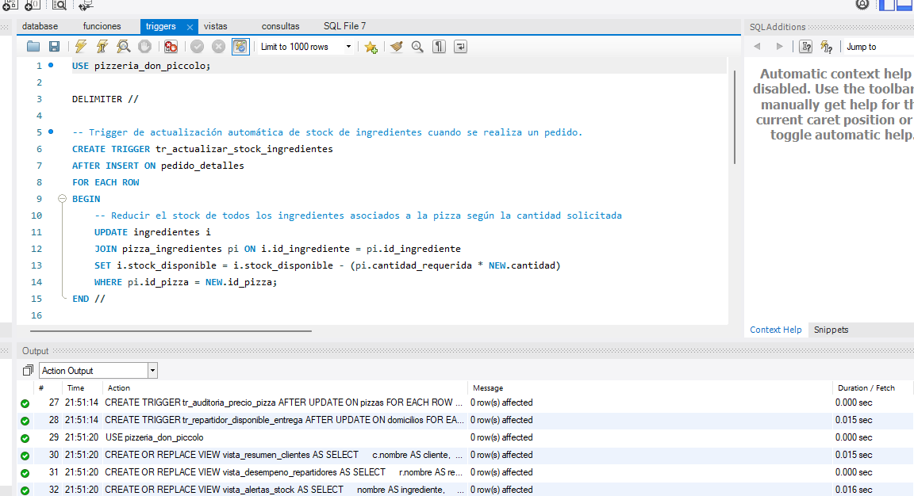
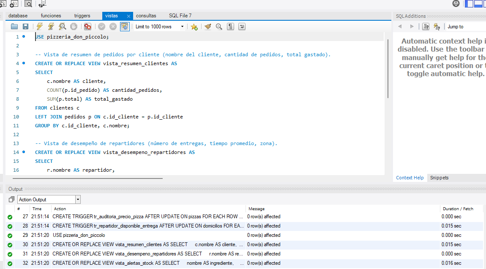
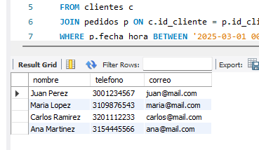
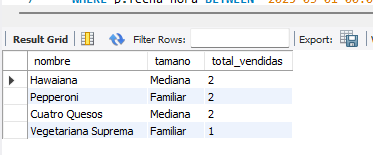
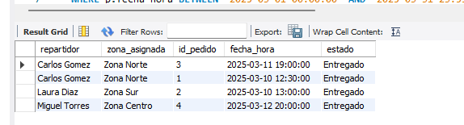
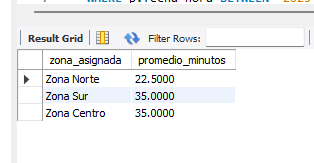
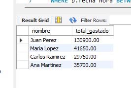
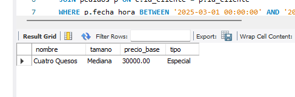
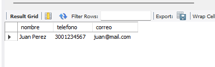

# 🍕 Pizzería Don Piccolo — Sistema de Gestión de Base de Datos

## Descripción del Proyecto

Sistema de base de datos relacional en MySQL diseñado para la **Pizzería Don Piccolo**. Permite gestionar de forma integral el ciclo completo de venta: registro de clientes, catálogo de pizzas e ingredientes, toma de pedidos, asignación de repartidores, seguimiento de domicilios y control de pagos.

El sistema incluye lógica de negocio automatizada mediante funciones, procedimientos almacenados y triggers, además de vistas para reportes gerenciales y consultas analíticas complejas.

---

## Estructura del Proyecto

```
/pizzeria-don-piccolo/
 ├── database.sql      → Creación de BD, tablas, relaciones y datos de prueba
 ├── funciones.sql     → Funciones y procedimientos almacenados
 ├── triggers.sql      → Triggers de automatización
 ├── vistas.sql        → Vistas de reportes
 ├── consultas.sql     → Consultas SQL complejas
 ├── PASO_A_PASO.md    → Tutorial detallado de construcción del proyecto
 └── README.md         → Este archivo
```

---

## Proceso de Diseño y Desarrollo

### ¿Cómo se diseñó el modelo de datos?

El primer paso fue identificar las **entidades del negocio** a partir de los requerimientos: clientes, pizzas, ingredientes, pedidos, repartidores y domicilios. Cada entidad se convirtió en una tabla.

Luego se analizaron las **relaciones** entre ellas:
- Un cliente puede hacer muchos pedidos, pero cada pedido pertenece a un solo cliente → relación **1:N** entre `clientes` y `pedidos`.
- Un pedido puede incluir varias pizzas y una pizza puede estar en varios pedidos → relación **N:M** (muchos a muchos). Esta relación no se puede representar directamente en una base de datos relacional, así que se resolvió creando la tabla intermedia `pedido_detalles` que conecta ambas.
- La misma lógica N:M se aplicó entre pizzas e ingredientes, creando la tabla puente `pizza_ingredientes` que funciona como el "recetario" de cada pizza.

### ¿Por qué se separaron los pedidos en dos tablas (pedidos y pedido_detalles)?

Seguimos el patrón clásico de **Cabecera-Detalle** (Header-Detail), usado en facturación y sistemas de ventas:
- La tabla `pedidos` es la **cabecera**: guarda la información general (quién pidió, cuándo, cómo pagó, el total).
- La tabla `pedido_detalles` son las **líneas del ticket**: cada fila dice qué pizza se pidió y cuántas.

Esto permite que un solo pedido tenga múltiples pizzas sin duplicar la información del cliente o la fecha en cada línea.

### ¿Cómo se implementó el control de inventario?

El control de stock se logró combinando dos elementos:
1. La tabla `ingredientes` almacena la cantidad disponible (`stock_disponible`) y la cantidad mínima segura (`stock_minimo`).
2. La tabla `pizza_ingredientes` almacena cuántos gramos de cada ingrediente lleva cada pizza (la receta).
3. Un **trigger** (`tr_actualizar_stock_ingredientes`) conecta ambas tablas: cada vez que se inserta una línea en `pedido_detalles` (se vende una pizza), el trigger busca la receta de esa pizza y resta automáticamente los ingredientes del inventario, multiplicando la cantidad de la receta por el número de pizzas vendidas.

De esta forma, el inventario se actualiza solo y nunca depende de que un empleado lo haga manualmente.

### ¿Cómo se resolvió el cálculo del total del pedido?

Se creó la función `calcular_total_pedido` que recibe el ID de un pedido y realiza tres operaciones internas:
1. Suma todos los subtotales de las pizzas del pedido (consultando `pedido_detalles`).
2. Suma el costo de envío si tiene domicilio (consultando `domicilios`).
3. Calcula el IVA (19%) sobre la suma de los dos anteriores.

Se usó `IFNULL(SUM(...), 0)` como protección: si el pedido no tiene domicilio, el `SUM` devolvería `NULL` y arruinaría toda la operación matemática. `IFNULL` lo convierte en cero.

### ¿Cómo se calculó la ganancia neta diaria?

La función `calcular_ganancia_diaria` necesita cruzar **4 tablas** en cadena para llegar desde un pedido hasta el costo de cada ingrediente:

```
pedidos → pedido_detalles → pizza_ingredientes → ingredientes
```

El camino lógico es:
1. Filtra los pedidos del día con estado "Entregado".
2. Para cada pedido, obtiene sus líneas (qué pizzas se vendieron).
3. Para cada pizza vendida, obtiene su receta (qué ingredientes usa y cuántos gramos).
4. Para cada ingrediente de la receta, obtiene su costo por unidad.

La fórmula de costo es: `gramos_receta × costo_por_gramo × cantidad_pizzas_vendidas`. Al final, resta este costo total del total de ventas para obtener la ganancia neta.

### ¿Cómo funciona la automatización de repartidores?

El ciclo de vida de un repartidor durante un domicilio se maneja así:
1. Cuando se le asigna un domicilio, su estado debería cambiar a "No Disponible" (esto se haría desde la aplicación al insertar en `domicilios`).
2. Cuando se registra la `hora_entrega` en la tabla `domicilios`, el trigger `tr_repartidor_disponible_entrega` detecta que el campo pasó de `NULL` a tener un valor, y automáticamente actualiza el estado del repartidor a "Disponible".

La condición del trigger (`IF OLD.hora_entrega IS NULL AND NEW.hora_entrega IS NOT NULL`) es crucial: solo se activa en el momento exacto de la entrega, no en cualquier actualización del domicilio.

### ¿Cómo se implementó la auditoría de precios?

Se creó la tabla `historial_precios` como un "log" silencioso. Nadie la alimenta manualmente. El trigger `tr_auditoria_precio_pizza` vigila la tabla `pizzas`, y cada vez que detecta un `UPDATE` donde el `precio_base` cambió (comparando `OLD.precio_base` con `NEW.precio_base`), inserta automáticamente un registro con el precio viejo, el nuevo y la fecha exacta del cambio. Esto permite rastrear el historial completo de precios de cualquier pizza.

### ¿Por qué se usaron vistas en lugar de consultas directas?

Las vistas actúan como "consultas guardadas". Se crearon tres porque representan reportes que el negocio necesita consultar frecuentemente:
- `vista_resumen_clientes`: Usa `LEFT JOIN` en vez de `JOIN` para incluir a clientes registrados que aún no han comprado nada (con pedidos = 0), en lugar de ocultarlos.
- `vista_desempeno_repartidores`: Usa `TIMESTAMPDIFF(MINUTE, ...)` para calcular automáticamente los minutos de diferencia entre salida y entrega, y `AVG()` para promediarlos por repartidor.
- `vista_alertas_stock`: Filtra solo los ingredientes donde `stock_disponible < stock_minimo` y calcula cuánto hay que reponer.

### ¿Cómo se identifican los clientes frecuentes?

Se usó una **subconsulta** (un `SELECT` dentro de otro `SELECT`):
1. La consulta interna filtra los pedidos del mes y año actuales usando `MONTH()` y `YEAR()`, los agrupa por cliente, y con `HAVING COUNT(*) > 5` se queda solo con los que tienen más de 5 pedidos.
2. La consulta externa usa `WHERE id_cliente IN (...)` para traer los datos completos (nombre, teléfono, correo) de esos clientes.

### ¿Cuál es la diferencia entre WHERE y HAVING en las consultas?

Se usaron ambos en el proyecto con propósitos distintos:
- `WHERE` filtra filas individuales **antes** de agruparlas. Ejemplo: `WHERE estado = 'Entregado'` (filtra pedidos uno por uno).
- `HAVING` filtra resultados **después** de agruparlos y calcular las funciones de agregación. Ejemplo: `HAVING SUM(total) > 500` (filtra los totales acumulados por cliente).

No se puede escribir `WHERE SUM(total) > 500` porque `WHERE` se ejecuta antes de que exista el `SUM`.

---

## Explicación de Tablas y Relaciones

El esquema contiene **9 tablas** organizadas así:

| Tabla | Descripción | Relaciones |
|-------|------------|------------|
| `clientes` | Datos de los clientes (nombre, teléfono, dirección, correo) | 1:N con `pedidos` |
| `pizzas` | Catálogo de pizzas (nombre, tamaño, precio, tipo) | 1:N con `pizza_ingredientes`, 1:N con `pedido_detalles` |
| `ingredientes` | Inventario de materias primas (stock, mínimo, costo) | 1:N con `pizza_ingredientes` |
| `pizza_ingredientes` | Tabla puente: receta de cada pizza (relación N:M) | FK a `pizzas` y `ingredientes` |
| `repartidores` | Personal de entregas (nombre, zona, estado) | 1:N con `domicilios` |
| `pedidos` | Cabecera de pedidos (cliente, fecha, pago, estado, total) | N:1 con `clientes`, 1:N con `pedido_detalles`, 1:N con `domicilios` |
| `pedido_detalles` | Líneas de cada pedido (pizza, cantidad, subtotal) | N:1 con `pedidos`, N:1 con `pizzas` |
| `domicilios` | Información del envío (salida, entrega, distancia, costo) | N:1 con `pedidos`, N:1 con `repartidores` |
| `historial_precios` | Auditoría automática de cambios de precio | N:1 con `pizzas` |

---

## Funciones, Procedimientos y Triggers

### Funciones (`funciones.sql`)

| Nombre | Descripción | Uso |
|--------|------------|-----|
| `calcular_total_pedido(id)` | Suma subtotales de pizzas + costo de envío + IVA (19%) | `SELECT calcular_total_pedido(1);` |
| `calcular_ganancia_diaria(fecha)` | Ventas del día - costos de ingredientes usados | `SELECT calcular_ganancia_diaria('2025-03-10');` |

### Procedimiento (`funciones.sql`)

| Nombre | Descripción | Uso |
|--------|------------|-----|
| `registrar_hora_entrega(id_domicilio, hora)` | Registra hora de entrega y cambia el estado del pedido a "Entregado" | `CALL registrar_hora_entrega(1, NOW());` |



### Triggers (`triggers.sql`)

| Nombre | Evento | Descripción |
|--------|--------|------------|
| `tr_actualizar_stock_ingredientes` | `AFTER INSERT` en `pedido_detalles` | Descuenta automáticamente los ingredientes del inventario según la receta |
| `tr_auditoria_precio_pizza` | `AFTER UPDATE` en `pizzas` | Registra en `historial_precios` cada cambio de precio |
| `tr_repartidor_disponible_entrega` | `AFTER UPDATE` en `domicilios` | Cambia el estado del repartidor a "Disponible" al registrar la hora de entrega |



---

## Vistas de Reportes (`vistas.sql`)

| Vista | Descripción | Consulta |
|-------|------------|---------|
| `vista_resumen_clientes` | Nombre del cliente, cantidad de pedidos y total gastado | `SELECT * FROM vista_resumen_clientes;` |
| `vista_desempeno_repartidores` | Número de entregas, tiempo promedio en minutos y zona | `SELECT * FROM vista_desempeno_repartidores;` |
| `vista_alertas_stock` | Ingredientes con stock por debajo del mínimo permitido | `SELECT * FROM vista_alertas_stock;` |



---

## Ejemplos de Consultas (`consultas.sql`)

### 1. Clientes con pedidos entre dos fechas (BETWEEN)
```sql
SELECT DISTINCT c.nombre, c.telefono, c.correo
FROM clientes c
JOIN pedidos p ON c.id_cliente = p.id_cliente
WHERE p.fecha_hora BETWEEN '2025-03-01 00:00:00' AND '2025-03-31 23:59:59';
```


### 2. Pizzas más vendidas (GROUP BY y SUM)
```sql
SELECT pz.nombre, pz.tamano, SUM(pd.cantidad) AS total_vendidas
FROM pizzas pz
JOIN pedido_detalles pd ON pz.id_pizza = pd.id_pizza
GROUP BY pz.id_pizza, pz.nombre, pz.tamano
ORDER BY total_vendidas DESC;
```


### 3. Pedidos por repartidor (JOIN múltiple)
```sql
SELECT r.nombre AS repartidor, r.zona_asignada, p.id_pedido, p.fecha_hora, p.estado
FROM repartidores r
JOIN domicilios d ON r.id_repartidor = d.id_repartidor
JOIN pedidos p ON d.id_pedido = p.id_pedido
ORDER BY r.nombre, p.fecha_hora DESC;
```


### 4. Promedio de entrega por zona (AVG y JOIN)
```sql
SELECT r.zona_asignada, 
       AVG(TIMESTAMPDIFF(MINUTE, d.hora_salida, d.hora_entrega)) AS promedio_minutos
FROM repartidores r
JOIN domicilios d ON r.id_repartidor = d.id_repartidor
WHERE d.hora_entrega IS NOT NULL
GROUP BY r.zona_asignada;
```


### 5. Clientes que gastaron más de un monto (HAVING)
```sql
SELECT c.nombre, SUM(p.total) AS total_gastado
FROM clientes c
JOIN pedidos p ON c.id_cliente = p.id_cliente
GROUP BY c.id_cliente, c.nombre
HAVING SUM(p.total) > 500.00;
```


### 6. Búsqueda parcial de pizza (LIKE)
```sql
SELECT nombre, tamano, precio_base, tipo
FROM pizzas
WHERE nombre LIKE '%Queso%';
```


### 7. Clientes frecuentes del mes actual (Subconsulta)
```sql
SELECT nombre, telefono, correo
FROM clientes
WHERE id_cliente IN (
    SELECT id_cliente
    FROM pedidos
    WHERE MONTH(fecha_hora) = 3 
      AND YEAR(fecha_hora) = 2025
    GROUP BY id_cliente
    HAVING COUNT(id_pedido) > 1
);
```


---

## Instrucciones de Ejecución

Ejecutar los scripts **en el siguiente orden** en un cliente de MySQL (Workbench, DBeaver, phpMyAdmin o consola):

| Paso | Archivo | Descripción |
|------|---------|------------|
| 1 | `database.sql` | Crea la base de datos, las 9 tablas con sus relaciones y los datos de prueba |
| 2 | `funciones.sql` | Crea las 2 funciones y el procedimiento almacenado |
| 3 | `triggers.sql` | Establece los 3 triggers de automatización |
| 4 | `vistas.sql` | Crea las 3 vistas de reportes |
| 5 | `consultas.sql` | *(Opcional)* Ejecuta las consultas analíticas de prueba |


> **Requisito:** MySQL 5.7 o superior. Asegúrate de tener permisos para crear bases de datos, funciones y triggers.
